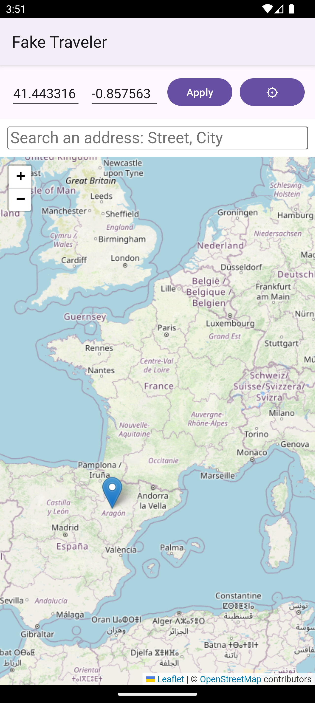
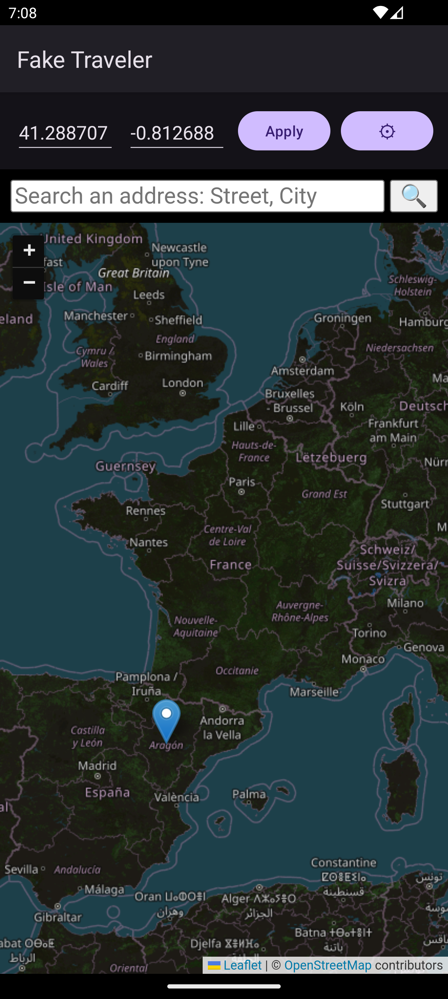
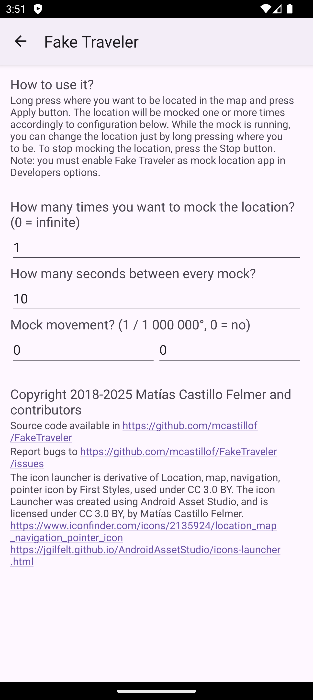
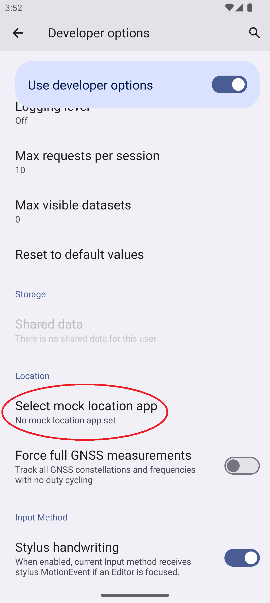
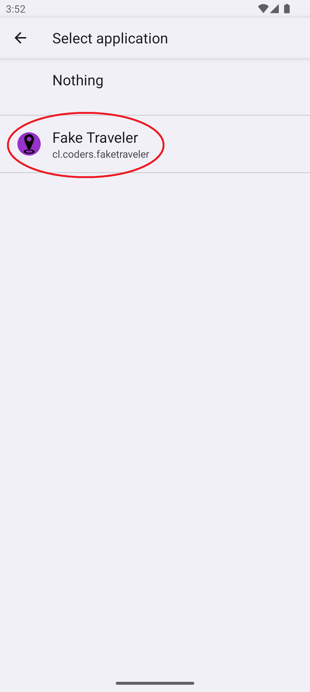

# FakeTraveler

Fake where your phone is located (Mock location for Android).

Sometimes you need to fake the location of your device (for privacy or to test an app). Fake Traveler provides you a map to select the location where you want your phone to be.

## How does it work?

Long press in the map where you want to be located or type the latitude and longitude, and tap the Apply button. Tapping the gear (⚙) button (formerly the "..." button) will show two settings to mock the location over a period of time. 

### Notes

If your reported location appears to bounce from one location to another or is otherwise unstable, you
may want to go to system **Settings**, and in **Location services**, disable **Wi-Fi scanning** and
**Bluetooth scanning** as these alternate location providers may compete with the GPS location data
you are mocking.

## Requirements?

In order to work, you need to allow Fake Traveler to mock locations. You have to [enable Developer options](https://developer.android.com/studio/debug/dev-options?hl=en-419) and select this app in "Settings/System/Developer options/Select mock location app" option.

## Changelogs

See fastlane/metadata/android/en-US/changelogs/

## License
Copyright © 2018 Matías Castillo Felmer

> This program is free software: you can redistribute it and/or modify
> it under the terms of the GNU General Public License as published by
> the Free Software Foundation, either version 3 of the License, or
> (at your option) any later version.
> 
> This program is distributed in the hope that it will be useful,
> but WITHOUT ANY WARRANTY; without even the implied warranty of
> MERCHANTABILITY or FITNESS FOR A PARTICULAR PURPOSE.  See the
> GNU General Public License for more details.
> 
> You should have received a copy of the GNU General Public License
> along with this program.  If not, see <https://www.gnu.org/licenses/>.

The launcher icon was created by @ArtistDev44 (see #77) - thank you very much for your work!
